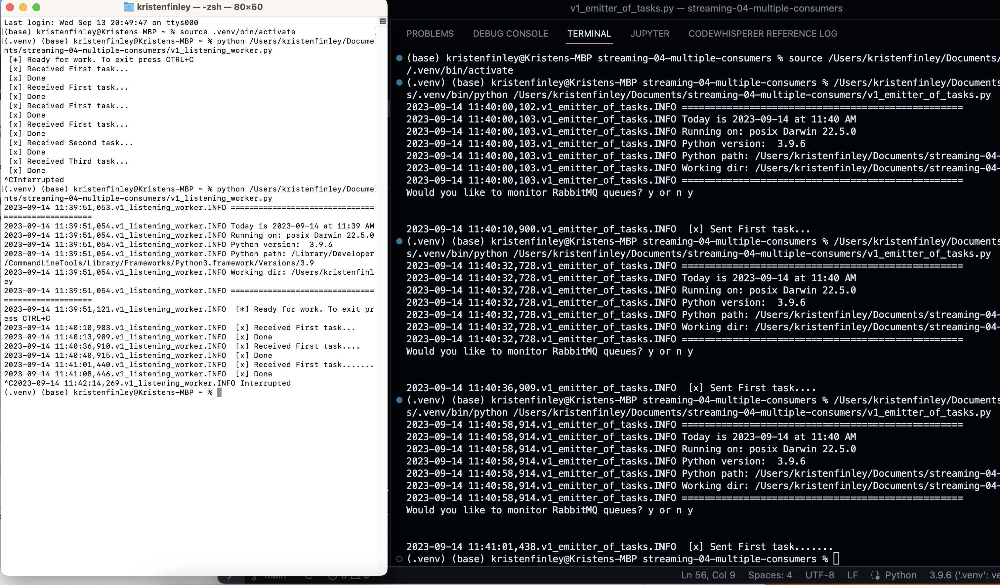
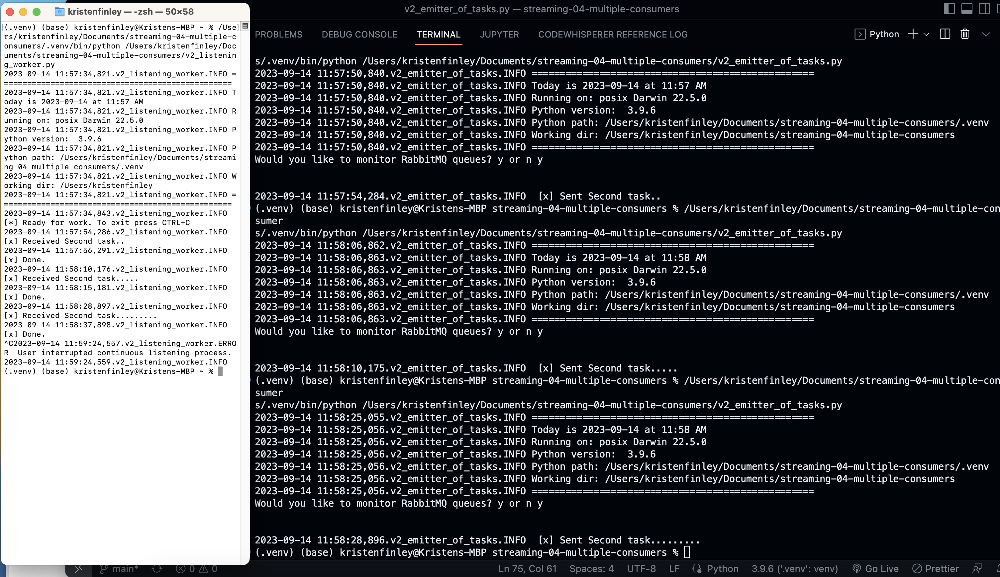
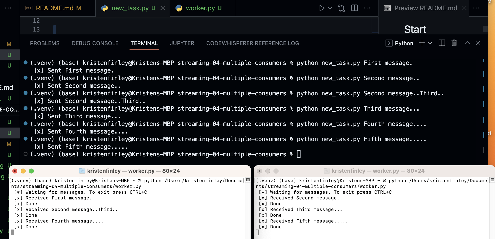
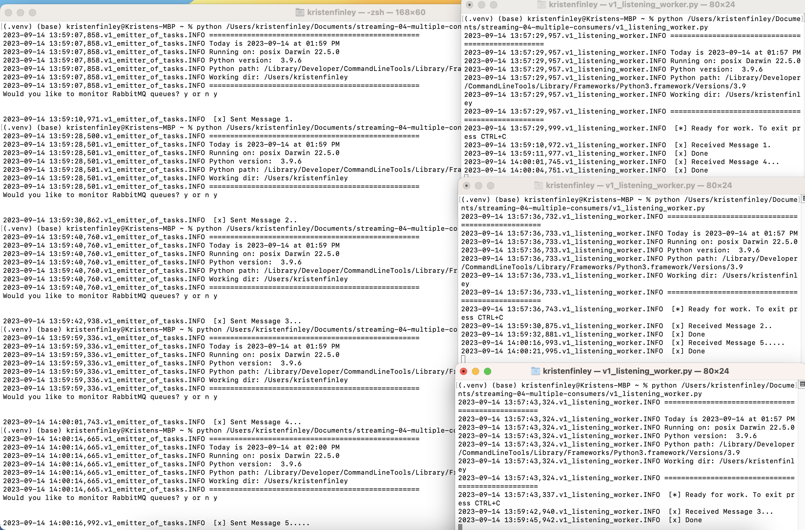
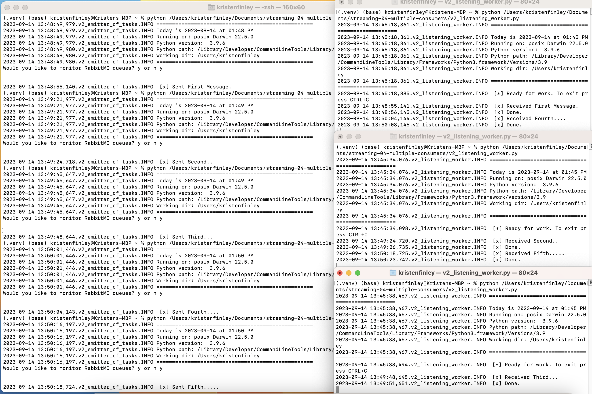
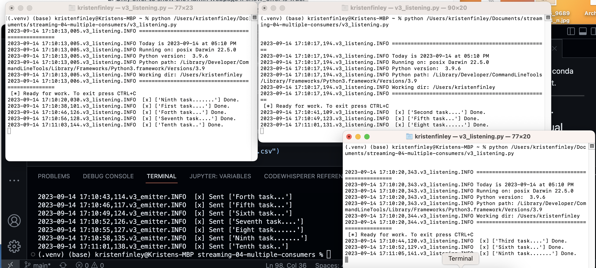

# P4: Producer with Multiple Consumers
## STREAMING DATA 44671-80/81FA23
### Kristen Finley
### Assignment 4
---
# streaming-04-multiple-consumers

> Use RabbitMQ to distribute tasks to multiple workers

One process will create task messages. Multiple worker processes will share the work. 

# Description of Tasks

## Setup Task 1. Created Virtual Environment

`python -m venv .venv`

## Setup Task 2. Activated the Virtual Environment

1. In the same VS Code terminal window, activated the virtual environment.

`source .venv/bin/activate`

2. Verified the virtual environment
 - making sure name (.venv) was in terminal prompt, ran 'util_aboutenv.py' 

## Setup Task 3. 
- Copied in requirement.txt file from previous repo.
- Installed Dependencies into the Virtual Environment using Pip

`pip install pika`

---

## Read

1. Read the [RabbitMQ Tutorial - Work Queues](https://www.rabbitmq.com/tutorials/tutorial-two-python.html)
1. Read the code and comments in this repo.

## RabbitMQ Admin 

RabbitMQ comes with an admin panel. When you run the task emitter, reply y to open it. 
    - username and password for intial log in "guest", update after acces.

(Python makes it easy to open a web page - see the code to learn how.)

## Execute the Producer

1. Run emitter_of_tasks.py (say y to monitor RabbitMQ queues)

Explore the RabbitMQ website.

## Execute a Consumer / Worker

1. Run listening_worker.py
---
### Will it terminate on its own? 
    Yes. The code instructs to close the connection to the server
    `connection.close()`

### How do you know?
    The terminal command line is ready for the next command.
---

## Ready for Work

1. Use your emitter_of_tasks to produce more task messages.

## Start Another Listening Worker 

1. Use your listening_worker.py script to launch a second worker. 
---
## Customized the project per P4 Instrctions
1. Converted from print statements to logging using util_logger.py from Module 3. 
1. Finalized work, documented results- showed output in files and screenshots
    Follow the instructions below to customize the project and make it yours. 

---
## Work Queue Tutorial
1. Created Files new_task.py and worker.py and followed [RabbitMQ Tutorial - Work Queues](https://www.rabbitmq.com/tutorials/tutorial-two-python.html)
1. Added multiple tasks (e.g. First message, Second message, etc.)
    - How are tasks distributed? 
    By default, RabbitMQ will send each message to the next consumer, in sequence.
1. Monitored the windows with at least two workers. 
    - Which worker gets which tasks?
     On average every consumer will get the same number of messages. This way of distributing messages is called round-robin.
1. Screenshots

---
## RabbitMQ - Working with the Examples
1. Used the files from this module's repo. 
1. Read and understand the code.
1. Updated the docstrings at the top of the file, and the code and comments as appropriate. For best results, follow [conventions](https://peps.python.org/pep-0008/).
1. Run 3 terminal windows at the same time.  Followed instructions at [Multiple Terminals](https://nwmissouri.instructure.com/courses/54849/pages/multiple-terminals).
1. Used one to emit messages representing work.  Each dot ( . ) makes the task take longer.
1. Created two or more listening workers to share the work. 
1. All examples use durable queues (understand these). 
1. All examples use consumer acknowledgements to confirm the work was done and the message can be deleted.
1. Version 1 and Version 2 perform pretty much the same processes, only the code organization is different in Version 2. 
1. Compare the versions. Verify both perform the same logic. 
1. Which version is easier to change the queue name? V2
1. Which is easier to change the host machine? V2
1. Which is easier to modify the message sent? No Difference noted
1. Hint:  Version 2 is again the more standard approach.
1. Try to organize your code more like the Version 2 examples throughout the course.
### Screenshots
- Version 1 with Multiple Terminals

- Version 2 with Multiple Terminals

---
## Your Project - Version 3 - Automating the Tasks

Built a Version 3 much like Version 2, except - instead of getting messages from the console the producer will read from tasks.csv. Much easier for the human! Multiple workers will retrieve the messages as they do in version 2. 
1.	As you code, follow conventions, show professionalism and good communication. 
2.	Copy the Version 2 files to start your version 3. 
3.	Keep the formal code comments - and as many as you need for understanding.
4.	You'll be writing apps on your own (following a specification) for the rest of the course - you'll want good notes/a good understanding of how to implement streaming systems that use RabbitMQ.
5.	Use docstrings at the top of the file and the start of each function.
6.	Modify your producer to slowly read tasks from tasks.csv instead of the console.  Hint: Go back examples from earlier modules.
7.	Use what you know about functions to make getting a message as reusable as possible!  
8.	Should you hardcode the data filename? Or would it be helpful to assign the filename to a variable?
9.	Do you like having the app open the RabbitMQ webpage? If so, modify it so it does it without asking - or so you can turn off the question as needed.
    1.	To turn off the question, introduce a variable "show_offer" and set it to False. 
    2.	Only offer to show the Admin webpage if show_offer is True. 
10.	Add more records to tasks.csv to make some longer running tasks (use more dots - periods - at the end of each task). 
11.	Update the README to include your name, the date, instructions for anyone who forks your repo and wants to try your project.
12.	Display your screenshot in the README.md showing at least 3 terminals (one emitting, two or more listening).
13.	Use comments in the code and the README.md to explain your version 3 RabbitMQ project. 
14.	Using VS Code or the command line, git add /commit (with a message!) and push / sync your code to your GitHub repo. 

### Screenshots
- Version 3 with Multiple Terminals

---
## Optional: Explore Docker
We can also use containers to work with streaming data. DockerLinks to an external site. containers allow us to precisely specify a Python environment - with RabbitMQ - already configured with a specific version of Python, pika, Jupyter, and other tools as needed.
1.	In part because of the complexities of all our different machines trying to run Python, many companies are switching to Docker to deploy and run containers with a standard set of configured software.
2.	As of yet, Docker still causes some machines to lag a bit, and as long as RabbitMQ is working on our machines, we might get by without requiring Docker to run on everyone's machine just yet.
3.	I encourage you to read about Docker and KubernetesLinks to an external site. (for managing Docker instances) and to be aware that organizations may be making use of these technologies.
4.	To get started, install Docker Desktop. 
5.	Create a free account at DockerHub.
6.	Read https://www.docker.com/blog/using-docker-desktop-and-docker-hub-together-part-1/Links to an external site.
7.	Share what you learn in the discussion forum. 

---
## Reference

- [RabbitMQ Tutorial - Work Queues](https://www.rabbitmq.com/tutorials/tutorial-two-python.html)
- [Assignment P4: Producer with Multiple Consumers](https://nwmissouri.instructure.com/courses/54849/assignments/857699?module_item_id=1893388)